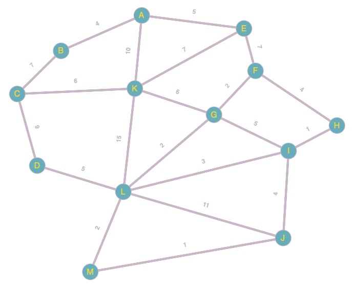

# Dijkstra's Shortest Path

This is a python implementation of Dijkstra's Shortest Path Algorithm.

# Running the Code

The source code is your friend, and contains a lot of helpful, unused functions. There are no external dependencies and pure python will run the following code. Run the test file to check this

# Graph in Example File

This is the graph that I refer to while performing the algorithm. The small text over the edges of the nodes are the distances / weights of the nodes.

